# UX-сценарии CRM Cleaner

Версия 1 · 9 сентября 2026 года

Это визуальная карта основного пользовательского пути и важных граничных состояний. Все записи, порталы, числа и даты демонстрационные. Изображения задают композицию и настроение; точное поведение определяется `PRODUCT.md`, `DESIGN-SYSTEM.md` и тестовой матрицей.

## Основной сценарий

### 1. Выбор сущности

Пользователь выбирает один тип данных для операции. В MVP показываем только принятые к реализации сущности.

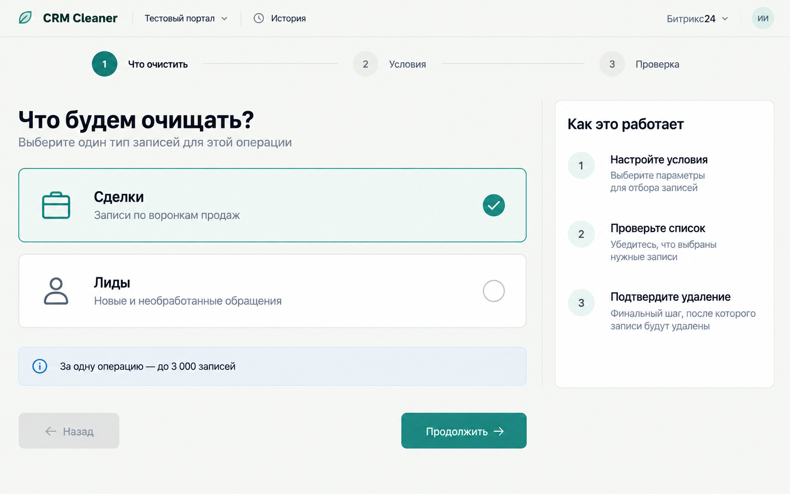

### 2. Настройка условий

Пользователь задаёт воронку, стадию, дату и ответственного. До поиска удаление невозможно.

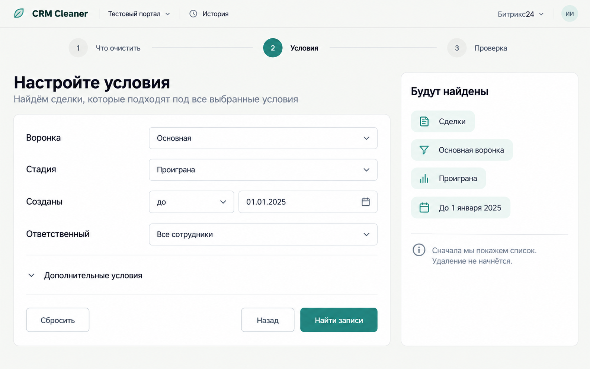

### 3. Сбор выборки

Приложение только читает данные и собирает полный список. Пользователь видит ход загрузки и может остановить поиск.

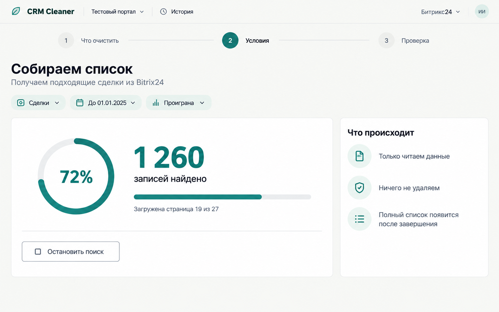

### 4. Проверка списка

Пользователь сверяет найденное, исключает нужные карточки и экспортирует CSV. Счётчики `Найдено`, `Выбрано`, `Исключено` всегда видны.

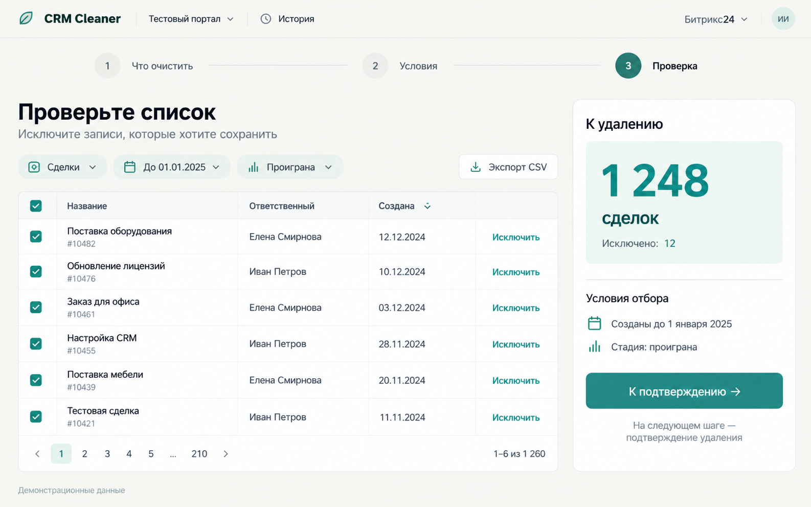

### 5. Финальное подтверждение

Пользователь повторно видит условия и точное количество. Здесь появляется единственная красная кнопка основного потока, потому что она непосредственно запускает удаление. Дополнительного ввода фразы нет.

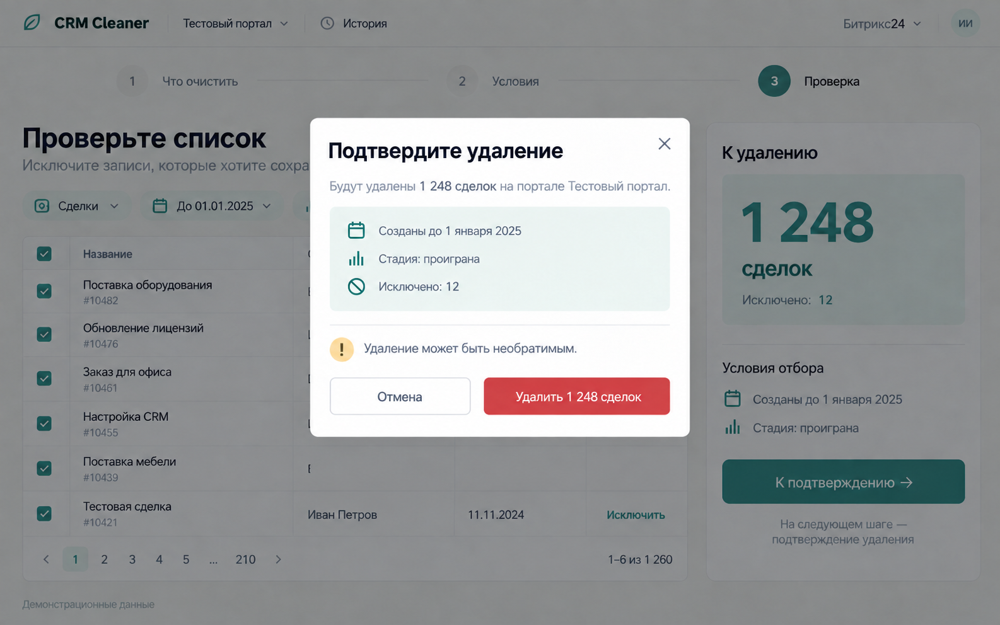

### 6. Выполнение удаления

Показываются обработанное количество и раздельные результаты. При закрытии вкладки новые запросы останавливаются; уже отправленные могут завершиться.

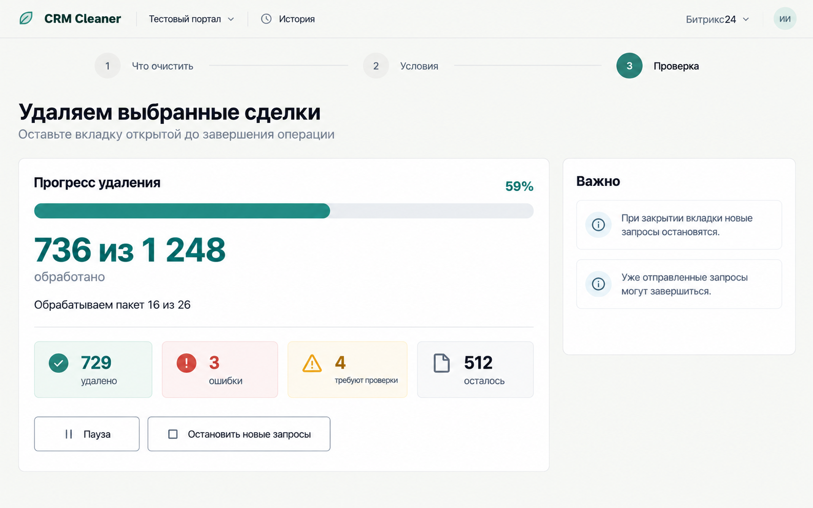

### 7. Полное успешное завершение

Все выбранные записи получили подтверждённый успешный результат. Пользователь может скачать итоговый CSV.

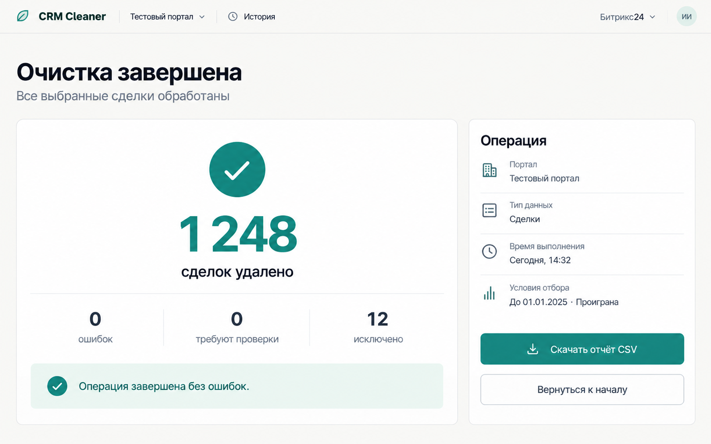

### 8. Завершение с проблемами

Ошибки и неизвестные исходы показываются отдельно от подтверждённых удалений. Неизвестный результат не считается успехом.

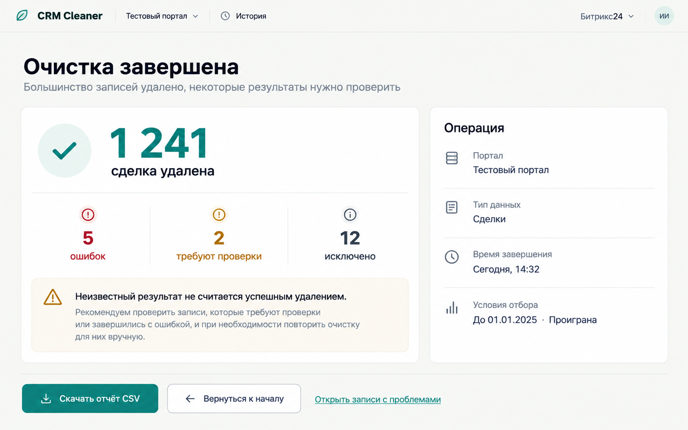

## Граничные и восстановительные сценарии

### 9. Ничего не найдено

При нулевой выборке пользователь возвращается к условиям. Запуск удаления отсутствует.

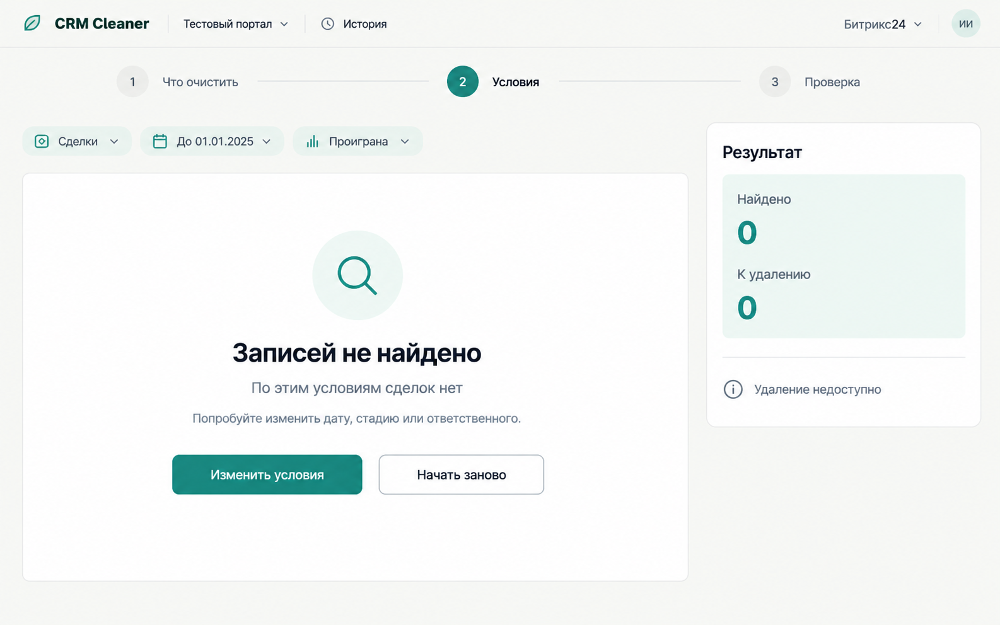

### 10. Найдено больше 3 000 записей

Список для удаления не формируется. Пользователь должен сузить условия или разделить очистку.

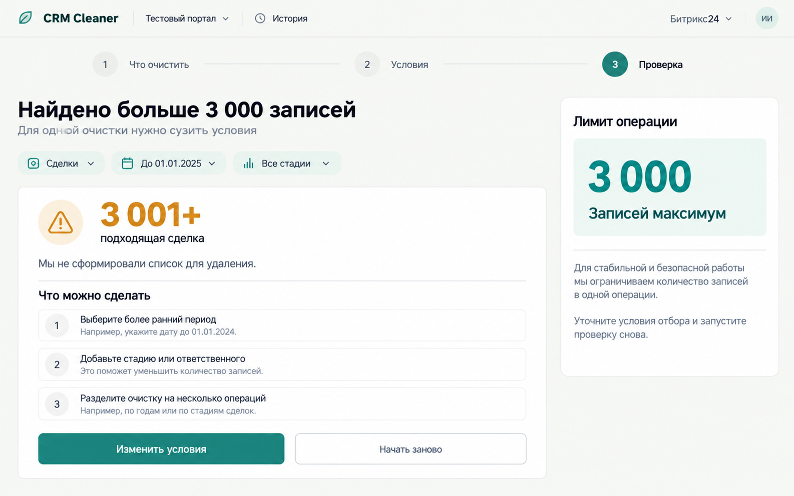

### 11. Пауза из-за лимита API

Новые запросы временно не отправляются. Текущий прогресс сохраняется, а интерфейс честно объясняет состояние уже отправленных команд.

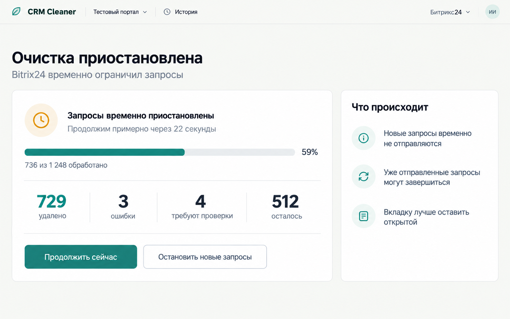

### 12. Возврат после закрытия вкладки

Приложение не продолжает операцию автоматически. Сначала сверяются неизвестные результаты, затем пользователь отдельно решает, продолжать ли оставшийся набор.

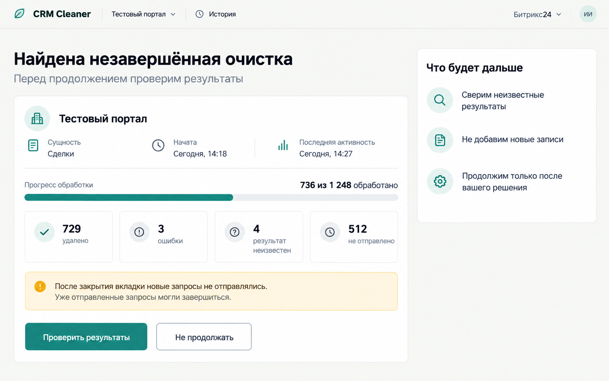

### 13. Ошибка доступа

При истёкшей сессии или недостаточных правах показывается понятная причина. Если удаление не начиналось, интерфейс прямо сообщает, что ни одна запись не удалена.

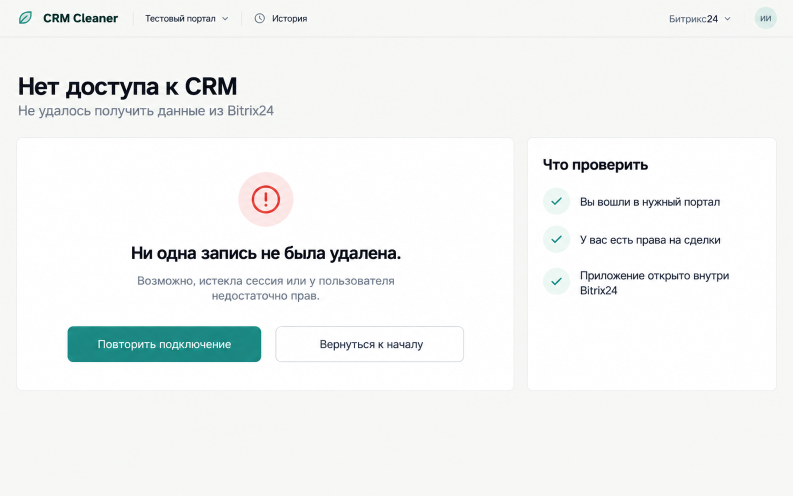

### 14. Локальная история

История показывает итог каждой операции и хранится в текущем браузере. Красное действие допустимо для безвозвратного удаления локальной истории.

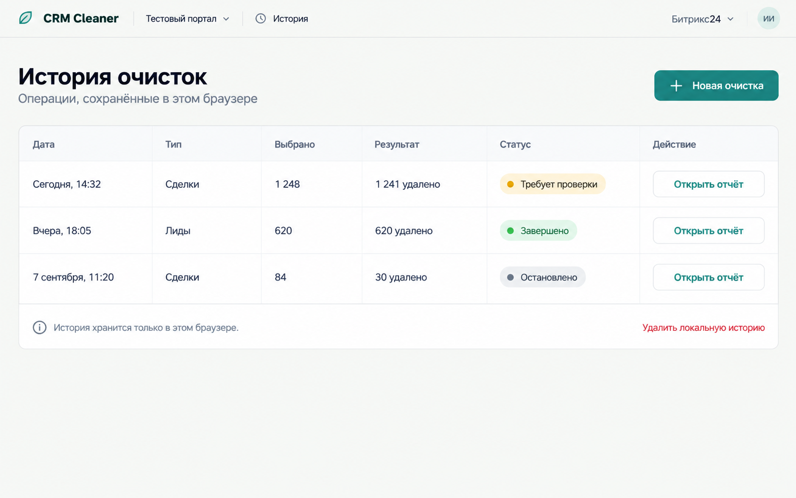

## Правила использования референсов

- Не копировать случайные неточности сгенерированного текста или пиксельные размеры.
- Сверять реализацию с токенами и семантикой `DESIGN-SYSTEM.md`.
- Для каждого состояния сохранять точные числа и честно разделять успех, ошибку, пропуск и неизвестный результат.
- Не добавлять обещание фоновой работы после закрытия вкладки.
- Не использовать красную кнопку для перехода, отмены, паузы, сброса фильтров или исключения записи из очистки.
